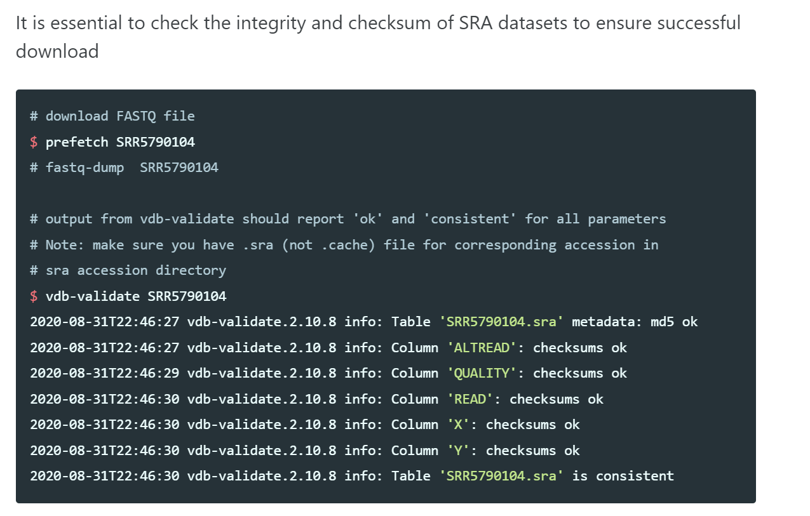

# NGS

## Repository Structure
```
.
├── README.md
├── data
│   ├── bam
│   ├── fastq
│   ├── harmonizedBam
│   └── vcf
└── src
    ├── 1-align
    ├── 2-clean
    ├── 3-variant
    └── 4-frequency
  ```

## Pipeline Overview
1) Prefetching `fastq` Dataset

  - Program: SRAtoolkit
  
BAM files are converted to fastq. Datasets are downloaded through prefetch commands.

The following steps are performed on each sequence (healthy and cancer) individually.

2) Genome Alignmnet

  - Program: [BWA-MEM](https://github.com/lh3/bwa)
  - Input: fastq file
  - Output: BAM file, aligned reads
  
Read groups are aligned to the reference genome.

3) Alignment Co-Cleaning

  - Program: [GATK](https://software.broadinstitute.org/gatk/) ([IndelRealigner](https://software.broadinstitute.org/gatk/documentation/tooldocs/3.8-0/org_broadinstitute_gatk_tools_walkers_indels_IndelRealigner.php) -> [BaseRecalibrator](https://gatk.broadinstitute.org/hc/en-us/articles/360036898312-BaseRecalibrator))
  - Input: BAM file, aligned reads
  - Output: BAM file, harmonized aligned reads
  
Improving alignment quality.

4) Somatic Variant Calling

  - Programs: [DeepVariant](https://github.com/google/deepvariant) or [MuTect2](https://gatk.broadinstitute.org/hc/en-us/articles/360047232772--Notebook-Intro-to-using-Mutect2-for-somatic-data) (Others: MuSE, VarScan2, Pindel)
  - Input: BAM file, aligned reads
  - Output: VCF file, raw simple somatic mutation
  
  - If using MuTect2, it takes in both the healthy and cancer sequence together to output one VCF file
  
Aligned and co-cleaned BAM files are processed through the Somatic Mutation Calling Workflow as tumor-normal pairs. Variant calling is the process by which we identify variants from sequence data.

If using MuTect2, can also annotate and filter.

5) Variant Filtering

  - Program: VarScan (filtering) or MuTect2
  - Input: VCF file, simple
  - Output: VCF file, filtered
  
Removes false positives.
  
6a) Variant Annotation

  - Program: ANNOVAR (annotation) or MuTect2
  - Input: VCF file, filtered
  - Output: VCF file, annotated somatic mutation
  
Annotates location of each mutation, its biological consequences (frameshift/silent mutation) and the affected genes.

6b) Variant Frequency

  - Program: some conversion program
  - Input: VCF file, filtered
  - Output: BAM

To determine the frequency of a variant, we can convert the filtered VCF file to BAM so that it can be processed using the GATK (toolkit).

  - Program: GATK
  - Input: BAM file
  - Output: Variant frequency (hopefully)

Find # of reads.


## Set-up Instructions
Many (or maybe all) of the software we will be using can be installed through conda/bioconda, which is a package manager. Conda simplifies the steps required to run a program, and set-up is often as simple as running one line of code. However, you may wish to get the software directly instead of through conda. This section will detail both ways.
### Installing Conda (if you wish)

### BWA-MEM
#### Option 1: With conda
Run one of the following commands ([source](https://anaconda.org/bioconda/bwa)):
- `conda install -c bioconda bwa`
- `conda install -c "bioconda/label/cf201901" bwa`
#### Option 2: Without conda
Navigate to the directory you want the bwa folder to be in, and run all of the following in sequence([source](https://github.com/lh3/bwa)):

    git clone https://github.com/lh3/bwa.git
    cd bwa 
    make

### Samtools
### Picard
### SRA Toolkit
### MuTect2


## Detailed Pipeline
### 0) Prefetching `fastq` Dataset

  <li>Program: SRAtoolkit</li>
  <li>Input: SRA accession number</li>
  <li>Output: fastq file</li>

    prefetch <<SRA accession number>>
    fasterq-dump <<SRA accession number>>



### 1) [Genome Alignment](https://hbctraining.github.io/variant_analysis/lessons/06_alignment_file_processing.html)
  
#### 1a) Indexing the reference genome

<li>Program: bwa index</li>
<li>Input: fastq - reference genome</li>
<li>Output: index files</li>
  
    bwa index <<reference.gz>>
    samtools faidx <<reference.gz>>
  
#### 1b) Aligning the reads to the reference genome

<li>Program: bwa mem</li>
<li>Input: fastq - reference genome, normal or tumour sample</li>
<li>Output: SAM file</li>

Something to keep in mind is whether your reads are paired-end or single-end. Paired-end data is when you have two reads for each fragment of DNA. One read is the forward read and the other is the reverse read (reverse complement). Single-end data is when you have one read for each fragment of DNA.

If you have paired-end data, you will need to align both the forward and reverse reads to the reference genome. `bwa mem` will automatically align the forward and reverse reads together. If the forward and reverse reads are in separate files, you will need to specify both files in the command. 

    bwa mem reference.[gz|fasta] paired_1.[fastq.gz|fastq] paired_2.[fastq.gz|fastq] > aligned_pairs.sam

If the forward and reverse reads are in the same file, you will only need to specify the file once and use the `-p` flag to indicate that the reads are paired-end.

    bwa mem -p reference.[gz|fasta] paired.[fastq.gz|fastq] > aligned_pairs.sam

    The alignment process identifies the most likely positions in the reference genome or transcriptome from which the reads originate.

detailed alignment instructions:

* add fastq file with the shortened read length + the reference genome both from ncbi into the visual studio code repo cloned from github and into your own files
*  stage + commit the addition of the files to the local repo
* push changes to branch from the main repo on github 
* download homebrew if not already installed
* using homebrew, download BWA compiler locally in the terminal ( here you have to have a C compiler and zlib downloaded)
*  write a tester c program in a seperate vs code file to check in terminal that the C compiler is working okay and downloaded correctly - it can cause a lot of problems
* download samtools using homebrew in the terminal
*  then index the reference genome in the terminal using bwa-index
*  using the code provided in the pipeline, replace the file names, file paths and header with the relevant ones
* (optional) use samtools (samtools view -Sb
aligned_reads.sam >
aligned _reads.bam) in terminal to 
convert the output from SAM to
BAM
* the aligned file is added to the git repo

### 2) File Conversions and Cleaning
#### 2a) SAM to BAM Conversion

<li>Program: samtools view</li>
<li>Input: SAM file</li>
<li>Output: BAM file</li>

    samtools view -bS <<input.sam>> > <<output.bam>>

The output of `bwa` is a SAM file and it is human-readable. However, it is large, so we compress it to a binary version (BAM) to save space.

#### 2b) Query-Sorting

<li>Program: picard SortSam</li>
<li>Input: BAM file</li>
<li>Output: BAM file, query-sorted</li>

    picard SortSam I=<<input.bam>> O=<<output.bam>> SO=queryname

BAM files are initially ordered by the order of the reads in the FASTQ file. This is not the same as the order of the reads in the reference genome. We sort the BAM file by the reference genome. This is known as query sorting and makes it easier to find duplicates.

#### 2c) Mark and remove duplicates

<li>Program: picard MarkDuplicates</li>
<li>Input: BAM file, query-sorted</li>
<li>Output: BAM file, duplicates removed</li>

    picard MarkDuplicates I=<<input.bam>> O=<<output.bam>> M=<<output_metrics.txt>>

Duplicates are reads that are identical to each other. These are often caused by PCR amplification. We mark and remove duplicates to avoid double-counting reads.

#### 2d) Coordinate Sorting

<li>Program: picard SortSam</li>
<li>Input: BAM file, duplicates marked</li>
<li>Output: BAM file, sorted by coordinate</li>

    picard SortSam I=<<input.bam>> O=<<output.bam>> SO=coordinate

Most downstream packages require the BAM files to be coordinate-sorted, so we re-sort the files now that we have removed the duplicates.

#### 2e) Indexing

<li>Program: samtools index</li>
<li>Input: BAM file, sorted by coordinate</li>
<li>Output: BAM index file</li>
  
      samtools index <<input.bam>>

Indices in alignment files help direct downstream packages to the regions of interest. We create an index file for each alignment file. This index (`.bai`) file is often called alongside the BAM file.

### 3) Variant Calling
#### 3a) Creating a sequence dictionary

<li>Program: picard CreateSequenceDictionary</li>
<li>Input: FASTA file</li>
<li>Output: sequence dictionary</li>

    picard CreateSequenceDictionary R=<<reference.fasta>> O=<<reference.dict>>

#### 3b) Variant Calling

<li>Program: GATK Mutect2</li>
<li>Input: sequence dictionary (reference), BAM file(s) (tumour, optional normal)</li>
<li>Output: VCF file</li>

##### i) Using Mutect2 in tumor-only mode

    gatk Mutect2 -R <<reference.fasta>> -I <<tumour.bam>> -O <<output.vcf>>
##### ii) Using Mutect2 in matched normal mode 

    gatk Mutect2 -R <<reference.fasta>> -I <<normal.bam>> -I <<tumour.bam>> -normal <<name of the normal file>> -O <<output.vcf>>
