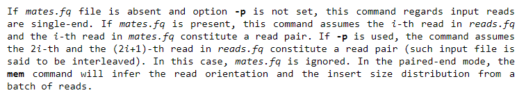
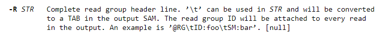

## Friday, July 28, 2023
- Background noise resolved
    - From Jasmin: "The reason there always appears to be some mutated alleles in the control sample is simply because Mutect2 adds a pseudo-count of 1 read to each allele. For example, for the KRAS mutation in the chr12 vcf file on the GitHub, the healthy tissue alternative allele frequency is reported as 0.037 while the total reads supporting each allele are 0 and 25, which with the pseudo counts add up to 1 and 26 and 1/27=0.037."

## Monday, July 25, 2023
- More discussion on background noise
- Fasterq-dump of cervical samples downloaded, some issues with identifying tumour vs normal samples
    -  Eventually resolved through SRA run selector, tumour samples have the tag neoplasm
-  Starting pipeline on:
    - Normal --> ERR4833601
    - Tumour --> ERR4833602

## Thursday, July 20, 2023
- Addressing background noise
    - Control samples also indicate some % of KRAS mutation --> odd
    - Possible reason: blood sample, tumour cells may be present
    - To-Do:
        - Test pipeline with other tumour-normal samples for different cancers and see if overlap is still present
        - Otherwise, somehow filter out? Might be a quality thing
    - Fusion events
        - Data for transcriptomes pre-assembled --> refseq, download G scripts (?) and assemble for fasta files
        - How to find? Align paired-end reads and see whether the read-ends match to difference chromosomes (OR if they are really far from one another, ~10^6 bp apart)

## Thursday, July 13, 2023
gRNA
- Should start looking at the TCGA datasets since they're highly processed, would be a better place to inform the guide designs
    - These also have normal solid tissue samples rather than the NCBI dataset, which only has blood samples (potential for contamination?)
    - The processing will hopefully have eliminated any other technical remnants or germline variants.
- Thinking about good targets for the gRNA
    - Indels probably not as great, less likely to be driver mutations? Would sometimes turn off tumour suppressors, not be very well expressed
            -
    - Driver mutations caused by Fusion events would be good to target, would be highly expressed and very unlikely to accidentally hit normal cells
        - Here's one for pancreatic cancer: [Oncogenic NRG1 fusions: A new hope for targeted therapy in pancreatic cancer](https://www.ncbi.nlm.nih.gov/pmc/articles/PMC6679796/) [and in general](https://www.ncbi.nlm.nih.gov/pmc/articles/PMC7470623/)
        - How to identify these though? Should be able to use paired end reads, if each end if of a completely different gene. Would have to do something during or before alignment though.
            - Align to the transcriptome instead of the genome?
            - [Recent advances in cancer fusion transcript detection](https://academic.oup.com/bib/article/24/1/bbac519/6918739#392958568)
    - Can go through TCGA data and classify which mutations are inhibiting vs activating since some would be better targets than others
        - If a mutation inhibits a gene it's probably not a good target since it's likely just trying to kill the gene.

     
gRNA Library
- Should test the three sites we choose before ordering the entire library as well.
- In terms selecting the target regions on the gene itself...
    - Do we use something like CrispON and input a sequence that will be the beginning of our longer gRNA? A sequence that would be the end of the gRNA? Both?
    - Make sure it has good GC content
    - Check structure as well to make sure that won't be doing funky things
- Could use the TIGER model from the paper that Dan sent. Since it's RNA, is probably a better jumping off point than the programs designed for Cas9.
    -  Can use what it gives us, then manually check that sequence in each position of the longer gRNA we make and recalculate things the GC content, structure, etc. to find the best option
    -  Can lso try to use their raw data to come up with general principles/rules, but not sure what would be generalizable besides RNA structure and melting temp which we already know.
 

## Thursday, July 6, 2023
Updates:
- Develop project description to give to Team India for collaboration
- Discussion on dry lab guide book -> skeleton is made, being fleshed out
- WetLab GUI project -> Hyerin + Olivia planning UI
- gRNA
    - GC content, Gibbs free energy
        - GC, Gibbs, Melting temp are all functionally the same? So don't need to consider all of them probably?
    - **Look into structure**, this is something many papers have not considered
- Instead of developing the library to build the model, should do it the other way around
    - Library will serve to validate the model
    - Library of 300 gRNAs too small for DL model
- The factors that make a gRNA successful seem to be equivalent for all crispr systems. Do we get much out of testing these again with our library of gRNAs?
    - Instead, will probably evaluate mismatches because they're factors that might be more unique to our system given the length of the gRNA.
        - Need to pick a few targets in the gene/"base gRNAs" that we know will bind well normally, and then test single mismatches at every position. Will have to be careful about which we select since they need to be good
        - Because indels are more likely to make the gRNA fail than other types of mutations, we can use them if we need a control that will hardly cleave or not at all
    - After considering mismatches and structure, when deciding on a gRNA out of multiple options: can just rank the criteria that have been established and select the one with the best metrics, don't necessarily need a complicated model

## Monday, July 3, 2023
gRNA
- Checking melting temp/gibbs in the middle and in the seed region
- Gonna test on HMG2?
- Need to check secondary structure to avoid hairpins
- [Tool to check GC content](https://support.snapgene.com/hc/en-us/articles/10383813095700-Show-a-Plot-of-GC-Content)

NGS Updates
- We have vcf files for: Chromosome 12 tumor only, Chromosome 12 matched normal, Full Genome matched normal
- Have been experimenting with different annotation flags, there are some for filtering as well
    - Miranda suggests not using these flags, and doing filtering and annotation afterwards using first GATK, then ANNOVAR, then whatever else
- Should probably use the panel of normals and germline resource inputs
    - Did some reading into them, need to look more to better understand what they actually do but they should be helpful
        - I think that PON is used to eliminte technical artifacts - it's created using a bunch of normal samples run in tumor-only mode, and each sample is supposed to have been taken using the same sequencing tech, prep methods, etc. ([Here's the GATK entry](https://gatk.broadinstitute.org/hc/en-us/articles/360035890631-Panel-of-Normals-PON-))
        - Germline inputs seems like another panel but uses the frequency of variants in the population. This gives a prior that the sample carries the variant allele, used in their probabilistic model. [Description of it here](https://gatk.broadinstitute.org/hc/en-us/articles/360050722212-FAQ-for-Mutect2#:~:text=The%20germline%20resource%20is%20used,statistical%20model%20for%20germline%20variation.)
- [Detailed Mutect2 docs](https://github.com/broadinstitute/gatk/blob/master/docs/mutect/mutect.pdf)

More NGS
- Raw VCF should be annotated (1) by GATK for sample specific annotations (e.g. allele depth, allele frequency) then (2) by VEP for annotations based on population databases (severity, PLI)
    (1) Need to do literature review to determine appropriate thresholds
    (2) VEP is like a centralized call for databases such as GNOMAD and CLINVAR. Can rank based on severity, how clinically damaging a variant is, etc.
- Some annotations include:
    - QC
    - DP
    - HWE
    - Allele depth and frequency
    - Missingness
    - etc.
- For the sake of time, Miranda suggests testing on Chr22 because it is the shortest

## Thursday, June 29, 2023 (Modeling Project)
Idea(s):
- PDE/ODE
    - Can turn into paper
    - Understand craspase system better
- Designing gRNA for CRISPR system
    - But we don't know anything about system
    - Can we test this
        - Bunch of gRNAs -> screen for efficiency
        - From this data, we develop a model for efficiency
---
- How?
    - Craspase cuts protein -> designing fusion protein where we have GFP fused to domain public degron 
        - GFP will get recycled and destryoed by cell
        - What if we put CSX30 between GFP and degron
            - If craspase is activated, GFP will not be recycled (we see in fluorescence)
    - Do this in lab, then use data to model
    - Compare between gRNAS, see which is efficient
        - More efficient is more cutting, so less GFP is degraded
- What to do?
    - Cloning gRNAs into a backbone and express in yeast
    - Yeast will have different gRNA
        - Let grow -> see population of each gRNA in cluster
    - Perform flow cytometry to sort based on GFP expression
    - Compare groups before and after (sorted by high GFP +ve)
        - Sequence gRNA in sorted group
        - Get new gRNA population %
            - If all equally efficient, we have same ratio
            - But if one is more efficient, its ratio will increase
- Models
    1) Given gene and these parameters, create these gRNAS
    2) Given gRNA sequence, predict efficiency -> AI model?
---
- Next steps
    - Create library of gRNAs that we want to test
        - Synthesize that ourselves
        - Need to see what parameters to vary in the library
            - Purposefully create gRNAs that we think are good, bad or mid to have a range of data
                - E.g. GC content, Gibbs free energy, etc.
            - When choosing gRNAs, make sure they are relatively unique
                - To prevent gRNA from binding to more than one site (want to bind to intended site)
---
- In yeast, express a gene that we want gRNA to target
    - Give this to model, generate a sequence of gRNA based on a given set of parameters
        - From gene, create a gRNA starting with each sequential BP
            - Determine its parameter values
---
## Thursday, June 29, 2023
Between NGS and gRNA
- NMD decay
- Mutation frequency
- Gene expression (Albert and Henry, done)
- RNA structure (based on predictions, less important)
- Prioritizing driver mutations (https://genomemedicine.biomedcentral.com/articles/10.1186/s13073-021-00830-0)

Guide Design
- Melting temperature, limited to mutation you chose
- Creating library of gRNAs
- From Henry's file, take sequence of genes in highest percentiles, and design gRNAs for those
    - Also need to check if they have the mutation we want to target

Updates:
- Mutect2 is working!
    - Have a successful run with chromosome 12, both tumor only and matched normal mode
    - Output vcf.gz files have been pushed to github
    - Memory usage: Runtime.totalMemory()=1358954496
    - KRAS is line 1166 on the matched vcf
- Review of rest of the pipeline
    - Filtering out false positives.
        - What criteria is this even based on?
        - Does it matter? Since we'll be targetting the mutations that are most expressed, which are least likely to be false positives anyway
    - Need to figure out what information is already given in the vcf from mutect and what more is needed
    - Are there other flags we can give to Mutect2 to get more information and skip some annotation/filtering steps?
    - Check out the programs Miranda sent: [ANNOVAR](https://annovar.openbioinformatics.org/en/latest/) and [GATK Variant Annotator](https://gatk.broadinstitute.org/hc/en-us/articles/360040095872-VariantAnnotator)
    - I'm also looking through gatk for other things to use (would be nice to have a program to help with vcf readability)
    

## Wednesday, June 28, 2023 (Lethbridge)
From Last Meeting
- Standardizing software on CC
- E.g. MD -> AMBER
    - Should have similar code
    - Should be able to send each other data wo looking into what data is (reproducibility)
    - Running MD in cc -> seed (tells program to run exxact same way each time)
- Send each other PDB files, using standards that we set, can we get matching results
Today
- Protein modeling -> unsure how much we would want 
- CC -> colab in establishing a how-to guide, how to get started in CC as an iGEM team
- Even other software, make accessbile (for teams outside of canada as well)
    - AWS (readily accessible almost anywhere)
        - Issue: cost!
        - Need team agreement to use AWS
    - Microsoft Azure
- How-to guide for cloud computing in general for dry lab teams
    - Latch? Provides on-demand cloud computing
        - They use AWS server (but for the tools that they provide, not our own programs? unsure will need to check)
- Standards for ige teams across the board
- Start with Canadian teams, then build from there
- Approaches
    - each team has their own software, so we can teach other how to use these softwares
    - Guides for specific softwares that we use
    - If we receive files from another team, can we run their software?
- So we don't have to learn brand new software
    - Synergy! 
    - Come up with miniature tutorials
- Send each other our files, and see if they can reproduce it -> also important to see compatibility between different systems
    - Genetic data -> key mutations
        - We give them the sfotware, do they get same mutations
        - Ensure that our results aren't through luck
    - MD simulations -> also similar results
- Timeline: one month to send data?
    - 'We gave same data to these teams, and here are their results. This is how we validated our results.'
    - How many teams do we want to include?
        - UofAlberta and UofCalgary (outreach from us and Lethbridge)
        - UBC?
- Dry lab Guidebook
    - Cloud computing
    - Git
    - Github
    - Gitlab (most relevant)

Summary
1) Dry Lab Guidebook for iGEM Teams
    - Cloud computing
    - Git
    - Github
    - Gitlab (most relevant)
2) Data Validation
    - Teams send each other data, software, and instructions, and we see if our results are reproducible

To-Do:
    - Send list of progarms and packages
    - We look into how to get into cloud computing, etc. 
    - Then when we exchange data, we also give them guidebook instructions

- Guidebook
    - OUtline by task
        e.g. I want to do genomics, here are the tools
            cover use cases
    - cover fundamentals
        CL
        AWS
        CC
        Gitlab

Cover use cases under each category
- explanations of what they do, how they work

1) Fundamentals
    - Data science
    - Statistics
2) Protein modeling
3) Genomics
4) Data science?
---
## Monday, June 26, 2023
Review of everything that's been done so far! Getting people caught up, short meeting overall

Updates:
- Henry will be running the expression level program over the TCGA's TSV files
    - As a metric Jasmin suggests first finding genes with sufficient level in a single file, then calculating what proportion of the files contain those genes
    - (This is opposed to averaging the expression level of of each gene across all files, since percentiles depend on the data in any given file and may not be representative)
- Roadblock on Mutect2 is preventing progress on later parts of the NGS pipeline
    - Long runtimes and memory errors mean that we will likely want to start running jobs on ComputeCanada instead of locally
        - Here are some resources for it: [What is a scheduler](https://docs.alliancecan.ca/wiki/What_is_a_scheduler%3F), [Running jobs](https://docs.alliancecan.ca/wiki/Running_jobs), and (less importantly) [CC's Job Scheduling Policies](https://docs.alliancecan.ca/wiki/Job_scheduling_policies)
- For the smaller projects/wet lab tools, we would like to make a GUI so that people who aren't familir with running a script or using the command line can easily use them
    - Need to start thinking about general design we want to have.. Dan suuggested having everything in a single program where people can select which tool they want to use
    - Also need to decide what language we'll be using for front end/how we'll be deploying everything
    - For now, code will be put in the tutorials folder
    - Olivia has volunteered to work on this; would also be a good project for people who are less experienced and want to contribute but don't have the time to invest in learning about the other aspects of our dry lab work
- Dan will start doing some lit review on gRNA design
- Need to create a strategy for how we want to test gRNA binding efficiency in the wet lab
    - Albert proposes using GFP and using flow cytometry
    - Issue is, how dod we decide what gRNAs to order and test? Do we want to target a single gene more comprehensively or try targetting mutiple mutations for some variance? Will definitely be a point of discussion moving forward
- Have begun discussing a modeling component of the project once again
    - What exactly will we be modeling? What data would we need for it from wet lab? How feasible would it be to get the data and complete the model?
    - Will be meeting with James on Thursday at 4pm to brainstorm more. Should do some lit review beforehand
- Meeting with Lethbridge to brainstorm collab ideas on Wednesday at 3pm
---
## Thursday, June 22, 2023
Questions/Updates:
- Optical duplicates vs amplification duplicates
    - Optical duplicates not marked by `picard` because of RG error, regular duplicates are being detected and removed
    - Optical are due to instrument error. Not sure why they aren't removed normally, they're probably not significant
- Two files produced by `fasterq-dump` -> paired-end reads, can indicate in `bwa mem` that we are inputting paired-end reads. Can ignore technical reads
    - May be aligned or "interleaved," will have to check the first couple lines of the fastq files to see if the reads match
    - In cases of a third file, will have to be aligned separately on its own.
    - 
- Why are we finding % of aligned reads?
    - Sanity check, making sure the data is good and we can proceed to next steps
    - Good % is context-dependent - when aligning to genome, ~85% is enough. Otherwise, would have to figure out what went wrong with collection, or something else
 - What info do we need for read groups?
    - [Listed here](https://gatk.broadinstitute.org/hc/en-us/articles/360035890671-Read-groups), but the naming is probably arbitrary and can work with whatever we call it.
    - Can add either with [picard AddOrReplaceReadGroups](https://gatk.broadinstitute.org/hc/en-us/articles/360037226472-AddOrReplaceReadGroups-Picard-) or during the alignment with bwa .
 - Albert completed script for expression level, will be testing more.
 - Jasmin recommended RNA folding structure prediction tool, [mfold](http://www.unafold.org/mfold/software/download-mfold.php)
  
Things to consider for future (and current) steps:
- Does our variant calling include masking of the germline variants?
- Make sure to add a step comparing to dbSNP to check for common mutations
- If normal data isn't great, can run tumor only and reference against common germline variants
- Indel realignment probably necessary for quality control still
---
## Monday, June 19, 2023
Assignments:
- Finding % of aligned reads (@elya)
- Getting raw fastq, aligning to reference genome and bringing them through preprocessing/mutect (@jennifertramsu, @bsegall02)
- Script to get expression level of different genes (@albert)
---
## Thursday, June 15, 2023
gRNA things to consider:
- Cas-9 DNA melting temperature
- mRNA structure
- expression level
- Whether the mutation kills the gene expression
- Frequency of those with mutation vs unmutated (and don't want it to bind to unmutated)
- Off targets are rarely an issue, usually a problem like paralogs since often things similar at the protein level would havae likely diverged at the DNA level
    - Can also check quickly by just blasting or using BWA, bowtie to search for similarities to the chosen gRNA
- More data on TCGA compared to SRA, much better for determing what genes to target vs SRA just to see the whole pipeline working from the start
    - [MAF files](https://portal.gdc.cancer.gov/repository?filters=%7B%22op%22%3A%22and%22%2C%22content%22%3A%5B%7B%22op%22%3A%22in%22%2C%22content%22%3A%7B%22field%22%3A%22files.access%22%2C%22value%22%3A%5B%22open%22%5D%7D%7D%2C%7B%22op%22%3A%22in%22%2C%22content%22%3A%7B%22field%22%3A%22files.data_category%22%2C%22value%22%3A%5B%22simple%20nucleotide%20variation%22%5D%7D%7D%5D%7D)
    -  Should also look to figure out what driver mutations are  known, try to get a fairly comprehensive list of known ones since that would influence the decision of what gRNA to use, whether the target is a driver mutation
        - [Software for finding driver mutations](https://genomemedicine.biomedcentral.com/articles/10.1186/s13073-021-00830-0)
- Some  of the factors are binary, but with those that are not, it's hard to know what weight to give to each of them.. May just have to guess if there isn't enough time to test a bunch of gRNAs in the lab

gRNA how to do it:
- Some packages for cas-9 are based on melting temperature, which should still work for our purposes
- folding, can use RNA fold, mostly 2D folding though: usually pretty good though
- Tools for detecting NMD (Nonsense mediated decay)
    - Found a tool, [NMD classifier](https://journals.plos.org/plosone/article?id=10.1371/journal.pone.0174798). Requires a transcript so we would want to feed it every transcript that ref-seq predicts
- Targetting expression level - would be good to target maybe top 50% because it tends to be logorithmic
    - Need to start working on this, shouldn't be too bad. Looking through MAF files Jasmin send and writing a script to get the fraction of samaples where the gene is expressed
---
## Monday, June 12, 2023
Updates:
- Pilar working on the BWA part of the pipeline
- Elya has alignment working starting with a FASTQ file 
    - GCh38 as reference genome from NCBI, results in a SAM equivalent to the downloaded file from the original SRA data site
    - Still does not have the % of aligned reads, further steps to figure out how to get that
    - Can copy paste read in the UCSC Genome Browser to benchmark the read and see how it maps
- Looks like we can't store in compute canada and run locally, but shouldn't be an issue to run job on there. Jasmin's students have rarely had to wait for resources to open up.

Tasks:
- Will create a new markdown file to log intructions when trying to set up and use the programs (@bsegall02 @jennifertramsu)
- Continue work for Mutect2, can use albert's paper as a reference for commands (@pilar @bsegall02 @jennifertramsu)
- % of aligned reads, start logging process on github (@elya)
- Everybody apply for compute canada account (@everybody)
- Get wet lab to make a list of tools that would be useful to have for us to start working on
---
## Thursday, June 8, 2023
Tasks:
- Running the [pipeline](https://github.com/bioinform/somaticseq)
    - Includes a manual on how to download and use SomaticSeq --> get this working
- From the manual
    1) (Alignment and Cleaning) Run `makeAlignmentScripts.py` with the necessary flags to trim, align, and mark duplicates (@pilar)
        - Input: fastq (tumour, normal), fasta (reference)
        - Output: merged fastq file, trimmed bam file
    2) (Variant Calling - Tumour-Normal Paired Mode) Run `makeSomaticScripts.py` to create scripts for MuText2, SomaticSniper, VarDict, etc. Use the flag `--run-workflow` to execute the scripts in parallel once the scripts are created (@jennifertramsu @bsegall02)
        - Input: bam (tumour, normal)
        - Output: ??
    - We will probably want to run MuTect2 individually. Will also need to find argument to pass to MuTect2 that calculates allele frequency.
- Compute Canada -> storing data on Compute Canada and finding out how to access the data locally (@bsegall02)
---
## Monday, June 5, 2023
Updates:
- Pilar found that marked dupliciates are useful but depends on the data. More useful in case there are issues with the data itself. 
    - A couple ways to do duplicates Mark Duplicate Spark: Reqires a lot of disk operations but optimized to run locally as best as possible (at least 16GB RAM recommended)
        - Compute Canada??!? for those of us who have weak computers
- BQSR (Base recalibration, finetuning quality scores) not 100% necessary but could give more detailed metadata.
- [Useful review paper](https://www.ncbi.nlm.nih.gov/pmc/articles/PMC8506910/) for an evaluation of the whole pipeline - Thanks Albert!
- TCGA has atlas for pancreatic cell lines and expression levels
- SHAD Python test run happening tomorrow

Problems/Tasks:
- Read the above paper depth to see if we're missing any steps or could be incorporating anything to improve results (@pilar, but everybody should read it)
- Try other parts of GATK to see if it's working/we can use it for other things. Ex. marking duplicates, which doesn't require reference file (@bsegall02)
- Continue trying to solve contigs issue for Mutect2. Ideas are renaming them in the fasta file, convertinig BAM to SAM, gzipping, and editing that, or looking for more reference files that have matching names (@besgall02, @jennifertramsu)
- Look through the github of Albert's paper, see if we can steal* their scripts to run the whole pipeline or individual parts (@pilar, @bsegall02)
---
## Thursday, June 1, 2023
Updates:
- Mutect2 should have a built-in function for mutation fractions, allele frequency
- Mutect2 is running without errors; except, there's no output
- Python SHAD drafts to be completed by Friday, test run on Tuesday
- The BAM -> Harmonized BAM step may be unnecessary. Depends on quality of data

Problems/Tasks:
- Figure out how to get the read count/fraction in Mutect2 output (@henry @olivialopardo)
- Solve output problem for Mutect2 (@bsegall02 @jennifertramsu)
- Look into BAM -> Harmonized BAM step, whether it's necessary and what tools to use (@pilar)
- Finish draft SHAD presentation/script, small edits in the activity and tutorial(@owen @bsegall02)
- Will start discussion on gRNA design: what factors to prioritize and what libraries can figure out those things (@albert @bsegall02 @jonas @henry)
---
## Monday, May 29, 2023
Problems:
- IndelRealigner not available in GATK > v3.6 -> look into alternatives (@olivialopardo)
- Calling Mutect2 on BAM files -> get GATK working then call Mutect2 (@bsegall02 @jennifertramsu)
- How to count # of reeds to get mutation frequency -> either manually or with a tool (@henry @olivialopardo)
    - Does Mutect2 already do this or do we need another tool?
