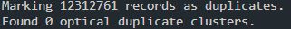

# Errors encountered and their solutions
## 1) Alignment
### Section 1b) Aligning the reads to the reference genome

- Problem: `bwa mem` throws the following warning:

        [M::mem_pestat] skip orientation RR as there are not enough pairs

- Solution: The paired end files are missing identifiers in their header names. The header names should end with `/1` and `/2` for the forward and reverse reads, respectively. This can be fixed using the flag `-R`. The argument is a read group header line with the sample name, library name, platform, and platform unit. The platform unit should end with `/1` and `/2` for the forward and reverse reads, respectively.

        bwa mem -R '@RG\tID:<<read_group_id>>\tLB:<<read_group_library>>\tPL:<<read_group_platform>>\tPU:<<read_group_platform_unit>>\tSM:<<read_group_sample>>' reference.[gz|fasta] paired_1.fastq paired_2.fastq > aligned_pairs.sam
        
## 2) Cleaning

### Section: 2c) Marking and removing duplicates

- Problem: `picard MarkDuplicates` gives the following warning:
    
        AbstractOpticalDuplicateFinderCommandLineProgram A field field parsed out of a read name was expected to contain an integer and did not. Read name: SRR12331371.100000157. Cause: String 'SRR12331371.100000157' did not start with a parsable number.

- Solution: `MarkDuplicates` expects to find a pattern in the reads' names (the lane, tile, and the X, Y position in the lane/tile). If your read names don't have a standard format, `MarkDuplicates` won't be able to find the information. This can be fixed using the flag `-READ_NAME_REGEX`. The argument is a regular expression that can be used to parse read names in the incoming file.    
#### 06/20/2023 Update

- Running the raw fastq file instead of the aligned Chr12 fastq
- Able to mark duplicates, unable to mark optical duplicates
- Unsure if this is significant
### Section: 3b) Variant Calling

- Problem: `gatk Mutect2` throws the following exception:

        java.lang.IllegalArgumentException: samples cannot be empty

- Solution: The BAM files are missing read group headers.

        picard AddOrReplaceReadGroups I=<<input.bam>> O=<<output.bam>> RGID=<<read_group_id>> RGLB=<<read_group_library>> RGPL=<<read_group_platform>> RGPU=<<read_group_platform_unit>> RGSM=<<read_group_sample>>

- Problem: `gatk Mutect2` throws the following exception:

        java.lang.IllegalArgumentException: Reference name for '91553841' not found in sequence dictionary.

- Solution: 

Notes
- MergeBamAlignment
        - Requires unaligned bam files (we don't have, need to download)
        - Quality step